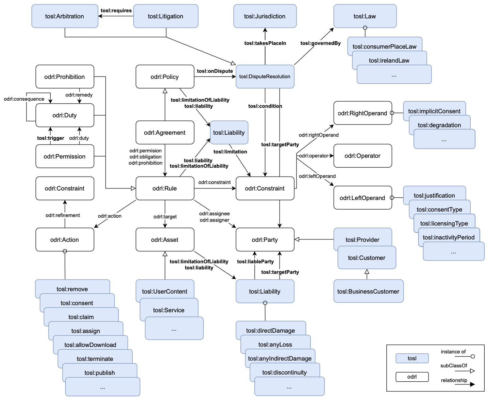

Terms of Service Language ODRL Profile (TOSL) is an ontology designed to represent contractual terms in Software-as-a-Service (SaaS) Terms of Service (ToS). It facilitates the representation of deontic modalities, providing the necessary semantics to formally define terms such as arbitration, governing law, content removal, liability, and modification/termination terms. This ensures precise and structured interpretations of contractual obligations, permissions and prohibitions.

## Repository Structure

`bin/`
Scripts for running SPARQL queries.

`examples/`
TOSL representations of real agreements.

`sparql_queries/`
SPARQL queries for analysing deontic modalities and identifying potentially abusive terms.

`tosl.ttl`
Ontology file (TBox), defining structured concepts and relationships.

## Functional Requirements 
1. **Representation of Deontic Modalities**

    The ontology should enable the formal representation of contractual terms through the explicit modeling of deontic modalities:

    - Obligations: Terms that mandate compulsory fulfillment.
    - Permissions: Terms that grant the right to perform certain actions.
    - Prohibitions: Terms that impose restrictions on specific actions.

    Additionally, the ontology must provide mechanisms to unambiguously identify:

    - The responsible party obligated to fulfill the term.
    - The asset or resource to which the action, permission, or prohibition applies.


2. **Identifying Potentially Abusive Terms**

    The ontology needs to be able to identify potentially abusive terms in consumer contracts, ensuring transparency and fairness. Answering competing questions related to arbitration, governing law, content removal, contract by using, jurisdiction, liability, and unilateral modifications or terminations. 
    
    <details>
    <summary><strong>Competency Questions</strong></summary>

    **Arbitration**

    - Is participation in arbitration fully optional for the consumer?
    - Does the arbitration term make arbitration mandatory before any court action can be taken?
    - Does the arbitration term require arbitration to take place in another country?
    - Is the arbitration process based on established law, or is it solely at the arbitrator's discretion?

    ---
    **Governing Law**

    - Is the governing law fixed (e.g., US federal law) and not the same as the consumer's country of residence?

    ---
    **Content Removal**

    - Can the service provider remove the consumer's content?
    - Are specific reasons for content removal explicitly stated in the contract?
    - Does the service provider have full discretion to remove content without providing reasons?
    - Is prior notice required to be given to the user before content removal?
    - Can the consumer retrieve the content before removal?

    ---
    **Contract by Using**

    - In what ways does the consumer provide consent to the terms of a contract?
    - Is the user legally bound by terms just by using the service?

    ---
    **Jurisdictions**

    - Does the contract specify jurisdiction for dispute resolution?
    - Does the jurisdiction term require dispute resolution in a different city, state, or country from the consumer's residence?

    ---
    **Limitation of Liability**

    - Does the contract state that the provider is liable for any damages or losses?
    - Is the provider not liable for damages incurred by malware or harmful software, as stated in the contract?
    - Does the contract contain blanket phrases like "to the fullest extent permissible by law" to limit liability?
    - Are there provisions in the contract where the provider disclaims liability for physical injuries, health issues, or loss of life?
    - Does the contract attempt to exempt the provider from liability for gross negligence or intentional damage?

    ---
    **Unilateral Modification**

    - Is the provider allowed to modify the contract unilaterally?
    - Does the contract require the provider to give notice before making changes?
    - Can the consumer terminate the contract if they disagree with the changes made by the provider?

    ---
    **Unilateral Termination**

    - Can the provider terminate the contract unilaterally? 
    - Does it specify specific causes, or termination is allowed without justified cause?
    - Is the provider required to give notice before terminating the contract?

    </details>

## Profile diagram
The figure below illustrates the concepts defined by the ODRL Profile for Terms of Service. These concepts facilitate the modeling of statements outlined in cloud provider agreements and enable the evaluation of the previously formulated questions to identify potentially abusive contractual terms.




## Sample with TOSL

```turtle
:permission11 a odrl:Permission ;
    dcterms:description "3.4 The Developer shall not display any advertising inside the Application or use any content as obtained via the API outside the Application, unless permitted by Elsevier in writing.";
    odrl:action [
        a odrl:Action ;
        rdf:value odrl:display ;
        odrl:refinement [
            a odrl:Constraint ;
            odrl:leftOperand odrl:media ;
            odrl:operator odrl:eq ;
            odrl:rightOperand "advertising"^^xsd:string ;
        ] ;
    ] ;
    odrl:target [
            a odrl:Asset ;
            dcterms:description "The asset refers to advertising materials, which cannot be displayed or used without a valid license agreement." ;
        ] ;    
    odrl:assignee :customer01 ;
    odrl:duty [
        a odrl:Duty ;
        odrl:action [
            a odrl:Action ;
            rdf:value odrl:license ;
            odrl:refinement [
                a odrl:Constraint ;
                odrl:leftOperand tosl:licensingType ;
                odrl:operator odrl:eq ;
                odrl:rightOperand tosl:writtenPermission ;
            ] ;
        odrl:assignee :elsevier ;
        ] ;
    ] .
```

## Running a Query

To run a SPARQL query on a Knowledge Graph (KG), use the following command. Modify the necessary arguments and review the queries carefully. There are two ways to execute the queries: using a Python script or a Jupyter Notebook. See `sparql_queries/unfair_terms/README.md` for more details on the SPARQL queries.

#### Using Python Script
1. Clone the repository.
2. In the root directory, execute the following commands. Be sure to specify the correct KG and query to execute a different one.


```bash
pip install -r bin/requirements.txt 
```

```bash
python bin/run_query.py "examples/elsevier/API_Service_Agreement.ttl" "$(cat sparql_queries/unfair_terms/termination.rq)" --format ttl
```

This command executes the SPARQL query unfair_terms_ter.rq on the ontology file API Service Agreement.ttl and returns the result.

```plaintext
    permission                       action                           target
--  -------------------------------  -------------------------------  ------------------------------
 0  http://example.com/permission04  https://w3id.org/tosl/terminate  http://example.com/service01
 1  http://example.com/permission06  https://w3id.org/tosl/disable    http://example.com/service01
 2  http://example.com/permission13  https://w3id.org/tosl/terminate  http://example.com/agreement01
````

#### Using Jupiter Notebook
1. Clone the repository.
2. Open the file `bin/run_query.ipynb`.
3. Execute the code cell and modify the KG and query as needed.

## References

- [odrl](https://w3c.github.io/odrl/)
- [odrl-model](https://www.w3.org/TR/odrl-model/)
- [odrl-vocab](https://www.w3.org/TR/odrl-vocab/)
- [Loss](https://link.springer.com/article/10.1007/s10603-015-9303-7)
- [CLAUDETTE](https://link.springer.com/article/10.1007/s10506-019-09243-2)
- [UCTD](https://eur-lex.europa.eu/legal-content/EN/TXT/?uri=celex%3A31993L0013)

-----------------------
Work developed by:
[Elena Molino](https://github.com/elenamolino),
[Jose Maria Cruz](https://github.com/cruzlorite),
[Jose Maria Garcia](https://github.com/josemgarcia), and
[Antonio Ruiz](https://github.com/antonioruizcortes)
