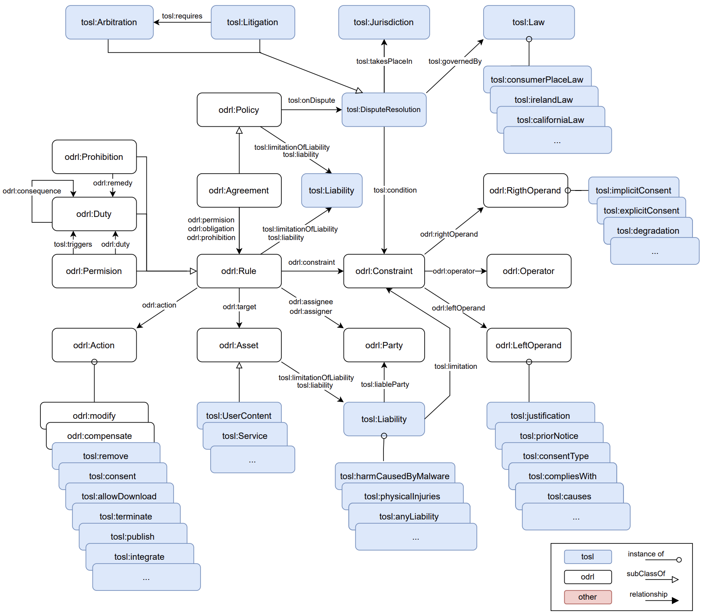

# Terms of Service Language ODRL Profile (TOSL)

An ontology designed to represent the Terms of Service (ToS) of online platforms

[ODLR](https://w3c.github.io/odrl/)

-----------------------
Work developed by:
[Elena Molino](https://github.com/elenamolino),
[José María Cruz](https://github.com/cruzlorite),
[José María Garcia](https://github.com/josemgarcia), and
[Antonio Ruiz](https://github.com/antonioruizcortes)