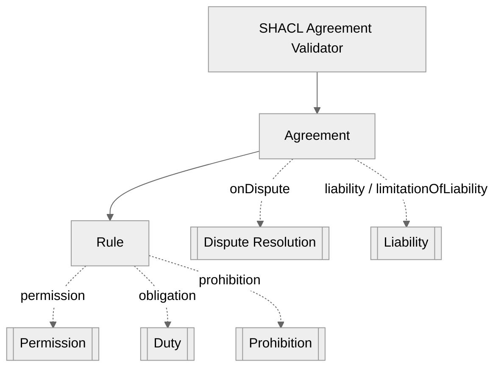
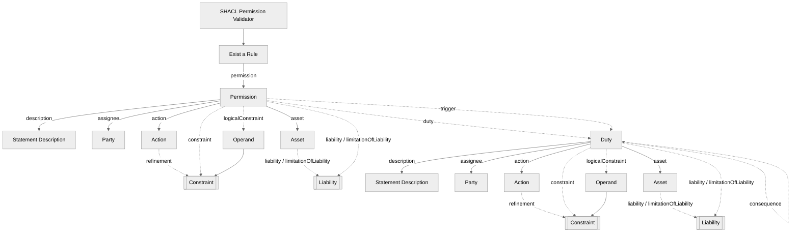
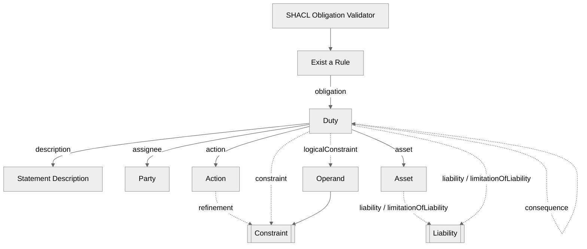
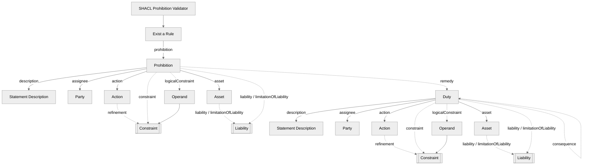
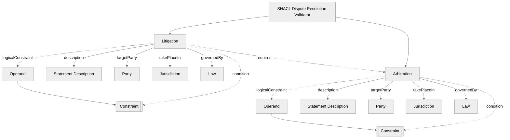
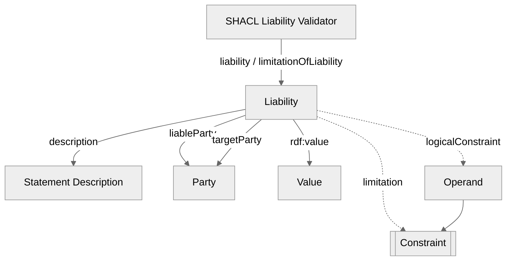
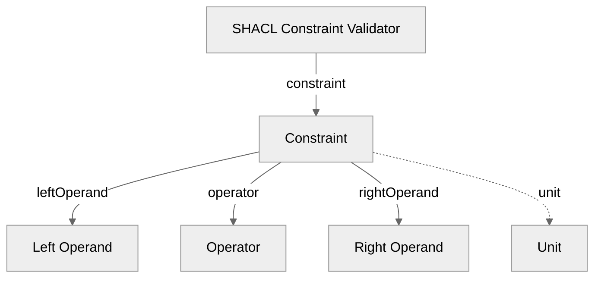

## TOSL Validator

These diagrams represent the **validator shapes** for **TOSL**. They visually describe the structure used to validate **permission**, **obligation**, **prohibition**, **dispute resolution**, and **liability** statements using **SHACL**.

- **Solid arrows** represent **mandatory** elements in the model.
- **Dotted arrows** represent **optional** elements in the model.
- **Subroutine-shaped nodes** indicate that an **auxiliary validation subroutine** exists for that object (e.g., **Liability** and **Constraint**).

#### Permission Rule Validator Diagram

#### Duty Rule Validator Diagram

#### Prohibition Rule Validator Diagram

#### Dispute Resolution Validator Diagram

#### Liability  Validator Diagram

#### Constraint Validator Diagram

